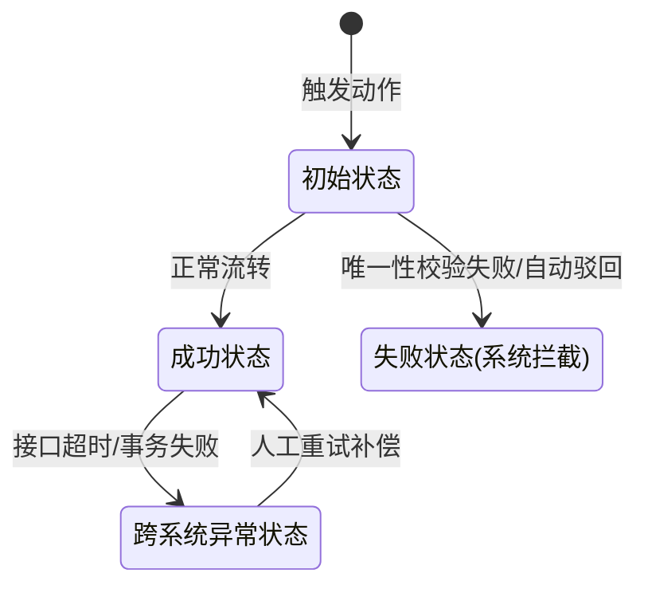

# [项目/模块名称] - 产品需求文档(PRD)与原型规范

> **规范说明**：本模板用于指导后续所有 B端管理系统（或类似运营平台）的需求拆解与原型生成。在让 AI 生成 PRD 与交互原型时，必须严格遵循以下 8 个核心章节的结构进行输出，确保业务逻辑、交互细节、底层异常校验与未来扩展性不遗漏。

---

## 1. 产品概述
- **业务背景**：简述为什么要做这个需求（如：解决某某业务痛点、支持某某新业务线）。
- **解决问题**：列举当前系统存在的缺陷或需要填补的空白。
- **目标价值**：预期的业务目标与系统价值（如：规范化操作链路、实现数据精准同步）。

## 2. 核心功能与菜单结构
### 2.1 菜单导航
- **所属层级**：明确功能在系统左侧菜单/顶部导航的具体归属位置（如：商品中心 -> 平台商品资料审核）。
- **入口规则**：不同角色、不同业务线下的菜单展示或拆分/合并逻辑。

### 2.2 核心流程与页面模块
> **要求**：按业务线（如：新增、变更）分模块详细描述。
- **触发时间点/入口**：从哪里、什么时机触发该业务流。
- **列表页规范**：
  - 列表排序规则（如：按提交时间降序 DESC）。
  - 核心展示字段与特殊标识（如：新增标识、状态高亮）。
- **详情页规范（多态自适应）**：
  - 不同来源、不同状态下的表单展现形态。
  - **必填兼容与默认值填充规则**：外部数据不满足内部必填强校验时的应对策略（前端展示为空 vs 后端静默赋默认值）。
  - **字段留存规则**：是否污染/扩展底层标库表结构。
- **核心操作闭环**：审核通过、审核驳回、二次确认等动作的具体行为逻辑。

## 3. 页面交互设计
### 3.1 页面整体布局
- 描述页面的基本框架（如：左侧固定导航、顶部状态栏、主内容区列表/详情卡片）。
- 明确响应式或抽屉、弹窗的交互形态。

### 3.2 可交互组件定义
| 组件类型 | 位置 | 交互行为 | 业务逻辑/反馈效果 (含异常提示) |
|---|---|---|---|
| [如：高级检索栏] | [如：列表页顶部] | [如：点击查询/重置] | [说明触发的过滤逻辑] |
| [如：通过/驳回按钮] | [如：详情页底部] | [如：点击] | [说明二次确认、必填项校验及成功/失败Toast] |
| [如：重试/同步按钮] | [如：异常状态单据] | [如：点击] | [说明幂等重放逻辑] |

## 4. 状态机流转 (State Machine)
> **要求**：必须使用 Mermaid `stateDiagram-v2` 语法绘制单据的完整生命周期，且必须包含【异常/失败】节点。

### 4.1 状态说明与异常处理（研发实现口径）
- **系统自动驳回场景**：什么条件下系统静默拦截并改写状态（如：唯一性冲突）。
- **入库/事务失败场景**：落库失败时的状态处理（不得对外回传成功、记录失败原因 error_msg、支持人工重放）。

## 5. 数据交互流程图 (Sequence Diagram)
> **要求**：必须使用 Mermaid `sequenceDiagram` 语法绘制跨系统/跨模块的时序图。**必须明确区分【审核表/中间表】与【标库表/正式表】**。

- **需体现的关键节点**：
  1. **第一重校验**：推单/生成单据前的唯一性拦截（熔断机制）。
  2. **第二重校验**：数据正式落库前的核心字段冲突校验。
  3. **静默补全**：入库前的默认值组装动作。
  4. **异步回传**：落库成功或失败后的异步通知闭环。

## 6. 字段字典与数据映射 (Data Dictionary & Mapping)
> **要求**：指导 BFF 层和前端的数据映射转换。
### 6.1 共性字段（双向同步）
- A系统字段 ↔ B系统字段。
### 6.2 特定平台专属字段
- 仅在特定平台 UI 中渲染，不入主标库的字段清单。
### 6.3 核心必填兜底逻辑（静默写入字典）
- 外部无法提供、但主系统底层必填的字段，后端入库时需静默写入的默认值清单（如：商品类型=商品，批准文号=无）。
### 6.4 局部更新/变更比对字段白名单
- 针对“修改/变更”业务，严格限定允许比对和更新的字段范围（超出范围的静默忽略）。

## 7. 历史数据兼容与架构扩展性 (Compatibility & Scalability)
> **要求**：保障系统上线平稳及未来迭代空间。
### 7.1 存量历史数据兼容方案
- **DB刷数规则**：新增字段在老数据中的默认值（如：老单据默认来源=ERP）。
- **BFF降级拦截**：空字段默认值补偿。
- **前端回退策略 (Fallback)**：遇到未知枚举时的 UI 渲染降级方案（如渲染老版复杂表单）。
### 7.2 多平台/多业务接入扩展性设计
- **后端架构建议**：策略模式 (Strategy Pattern)、适配器模式 (Adapter)。
- **前端架构建议**：动态表单工厂组件 (`<FormFactory platformId={xxx} />`)。
- **配置化建议**：差异比对字段清单抽离至 Nacos 或字典表，拒绝硬编码。

## 8. 研发验收清单（开发需知）
> **要求**：提炼最核心的研发红线。
1. **多态适配**：严格按标识路由不同视图。
2. **防重与并发**：说明明确的唯一性约束字段（如：来源+编码+新增标识）。
3. **隔离与置空**：严禁前端对未下发数据赋伪值绕过校验。
4. **容错与重试**：跨系统交互必须有死信队列或手动重试补偿机制。
5. **局部更新**：更新接口必须支持 Patch（按需更新）。
