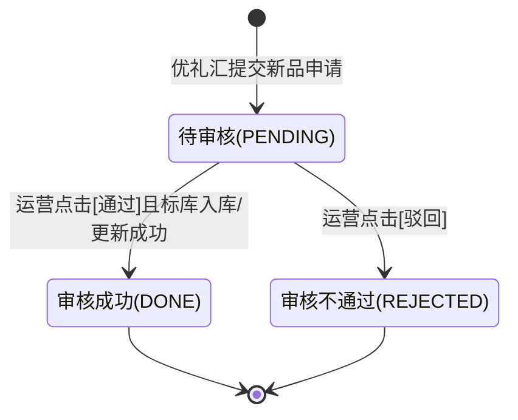
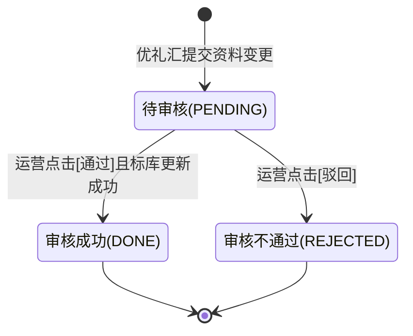
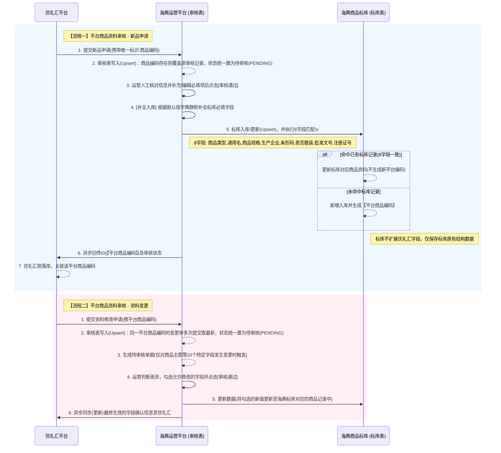

# 海典商品标库-优礼汇对接-产品需求文档(PRD)

## 1. 产品概述
基于海典运营平台，针对“优礼汇”来源商品的审核业务进行重构，将审核场景明确拆分为“新增审核”与“商品资料修改审核”两条独立业务线。
- **解决问题**：区分“无平台编码的新增审核”与“有平台编码的修改审核”，使业务流程更加清晰。同时**彻底解决来源平台异构问题**，针对优礼汇商品的审核需单独展示优礼汇的定制化字段体系，与海典原有的商品字段进行差异化渲染。
- **目标价值**：规范化海典运营平台的操作链路，确保数据在“标库”与“优礼汇”两端的精准同步与流转。

## 2. 核心功能与菜单结构
### 2.1 菜单导航
左侧导航合并为一个统一入口（归属于“商品中心” -> “平台商品资料审核”类目下）：
1. **平台商品资料新增&审核** 
   - 统一承接原有的“商品数据填报平台审核（新品申请）”以及“平台商品资料修改审核（资料变更）”两大业务流。
   - 通过列表中的“新增标识”字段区分为“新品申请”或“资料变更”。

### 2.2 核心流程与页面模块
#### 业务线一：平台商品资料新增&审核（优礼汇新增后的审核）
- **业务场景/入口**：功能入口为“运营平台-平台商品资料新增&修改审核（平台商品资料修改审核）”。
- **触发时间点**：优礼汇侧商品**上架时**，判断是否已有平台商品编码。若无，则走本新增逻辑，推单至海典生成待审核记录。
- **业务流程**：优礼汇申请 → 海典运营平台审核 → 审核通过 → 系统生成【平台商品编码】 → 存入海典商品标库 → 接口同步回传优礼汇。
- **列表页**：展示优礼汇提交的新品列表（此时无平台商品编码），列表新增“新增标识”与“来源平台”字段，其他字段与现有字段保存一致。**列表数据按提交时间降序（DESC）排列**。
- **详情页（双形态自适应展示）**：
  - **来源为“优礼汇”时**：
    - 页面严格渲染为“优礼汇字段版”。
    - **必填兼容与默认值填充规则**：与海典原有必填项无法对应时（如未传海典必填的“剂型”等），因优礼汇无该数据，该输入框**直接展示为空**，需运营人工补充或评估后放行。**注意：优礼汇必填字段与商品标库字段无法全部对应，且标库为必填时，后台入库时需按指定规则进行默认值写入（详见7.3节）**。
    - **字段留存规则**：因优礼汇侧商品字段与标库字段不一致，**标库不会为了优礼汇去扩展字段结构**。优礼汇专属字段仅在“审核流程”的独立表单中作调阅展示（不计入现有标库字段表）。新增审核通过后，运营前往“商品标库”查看该商品时，**仅会显示在标库中真实存在并成功映射入库的字段内容**。
    - **审核字段清单及输入逻辑**：
      - **基础信息（文本输入/只读）**：商品编码、商品名称、商品条码、规格、单位、产地、保质期、生产企业。文本输入框（Text），默认带入优礼汇数据，允许修改。
      - **标库必填字段（只读文本）**：商品类型、批准文号、注册证书、是否散装中药、商品功效大类、剂型、商标、是否含特殊药品复方制剂。前端不可编辑（Disabled），系统按 PRD 默认值字典进行锁定展示。
      - **类别信息（级联选择）**：商品类别。需运营手动选择海典系统的商品分类体系。
      - **图片（画廊展示）**：商品主图(1张)、商品橱窗图(5张)。图片展示组件，支持预览放大，不允许在当前页重新上传替换（以优礼汇推图为准）。
  - **来源为“非优礼汇”（来源平台展示为“-”）时**：
    - 维持海典现有的“基础信息”大表单结构（包含旧系统编码、商品描述助记码等复杂的填报信息）。
  - **核心操作**：
    - **类别信息补充**：类别信息需审核员自行录入，审核通过时进行必填校验。
    - **审核通过**：系统自动生成平台商品编码并入库，同时触发同步接口至优礼汇。
    - **审核驳回**：需填写驳回原因，单据终止流转，回传驳回状态至优礼汇。

#### 业务线二：平台商品资料新增&审核（优礼汇修改后的审核）
- **业务场景**：已对码入库的商品，在优礼汇侧发生了资料变更，推送到海典平台进行二次审核。
- **业务流程**：优礼汇修改字段 → 海典运营平台审核 → 审核通过 → 同步修改海典标库对应字段 → 接口同步确认结果至优礼汇。
- **列表页**：展示优礼汇提交的修改单（此时**已有平台商品编码**）。
- **详情页**：
  - **差异对比表**：展示发生变更的字段。表头为“字段名 | 平台商品信息(原值) | 修改商品信息(新值) | 是否更新(复选框)”。
  - **特定变更字段限定**：当优礼汇平台中【商品主图、供应商编码、商品编码、商品名称、商品条码、规格、单位、产地、保质期、生产企业】这些字段变更时，才生成资料变更审核记录，差异对比表仅罗列这些变更字段的具体值。
  - **图片差异对比**：独立展示原图与新图的缩略图比对，支持“是否更新”复选框。
  - **必填字段参考（标库默认值）**：页面需展示标库必填字段的默认赋值结果（只读不可编辑），用于运营理解最终入库口径。
  - **类别与橱窗图**：页面需展示商品类别，以及商品橱窗图(5张)内容供运营核对。
  - **核心操作**：
    - **审核通过**：仅将“已勾选(是否更新=true)”的字段变更应用至海典商品标库，并触发同步接口至优礼汇。
    - **审核驳回**：同上。

## 3. 页面交互设计
### 3.1 页面布局
- 左侧为固定菜单栏（商品中心分类下）。
- 顶部为系统状态栏及当前页面包屑导航。
- 内容区为列表检索区或详情卡片区。

### 3.2 可交互组件
| 组件类型 | 位置 | 交互行为 | 业务逻辑/反馈效果 |
|---|---|---|---|
| 高级检索栏 | 列表页 | 点击“查询” | 根据状态、关键词等多维度组合过滤列表数据 |
| 操作列按钮 | 列表页 | 点击“审核/查看” | 路由跳转至对应的审核详情页，并加载单据数据 |
| 差异复选框 | 编辑审核详情页 | 勾选/取消勾选 | 动态决定该字段在“审核通过”时是否要同步覆写到商品标库 |
| 图片缩略图 | 审核详情页 | 点击 | 弹出全屏图片画廊，支持左右翻页与放大预览 |
| 审核通过按钮 | 审核详情页 | 点击 | 弹出二次确认弹窗；确认后调用后端接口，成功则提示“审核通过，已生成...”，并返回列表 |
| 审核驳回按钮 | 审核详情页 | 点击 | 弹出必填的原因输入框弹窗；提交后状态变更为“已驳回”并返回列表 |

## 4. 状态机流转 (State Machine)
分别针对“新品申请”和“资料变更”两类单据定义生命周期状态机。

### 4.1 新品申请状态机

### 4.2 资料变更状态机

### 4.3 状态说明（研发实现口径）
- **状态精简**：废弃了原有的中间状态与异常补偿状态（无回调重试等），状态机精简为“待审核”、“审核成功”、“审核不通过”三态流转。
- **重复提交覆盖（审核表层）**：优礼汇可对同一商品多次提交（新增/变更）。系统在写入审核表时按唯一键进行 Upsert（覆盖写入）：若已存在同业务键的审核记录，则用最新推单内容覆盖原记录，并将状态重置为`待审核(PENDING)`，由运营重新审核。
- **新品重复提交的状态不回退**：若该商品的新品审核记录已进入`审核成功(DONE)`（或已生成平台商品编码），后续新品重复提交仅回传既有平台商品编码与“已审核”状态，不再将状态回退为`待审核(PENDING)`。
- **资料变更重复提交的记录策略**：若该商品存在审核成功（DONE）的资料变更单据，后续再次提交资料变更时需新增一条审核记录（新增一行），不覆盖已完成的历史审核记录；若当前仍为待审核，则按最新推单覆盖该未完成记录。
- **标库8字段校验（标库层）**：运营点击“审核通过”后，写入标库前对8个核心字段进行一致性匹配。若命中已有标库记录，则按“更新标库资料”执行（Upsert-Update）；若未命中，则新增入库并生成平台商品编码（Upsert-Insert）。两种情况均视为入库成功，单据进入`审核成功(DONE)`。

## 5. 数据交互流程图 (Sequence Diagram)
分为“新品申请”和“资料变更”两套核心数据流转流程。在此过程中，系统对**审核表**与**标库表**均采用 Upsert（覆盖/更新）策略，保证“多次提交取最新”，并在标库侧按8个核心字段进行匹配后执行新增或更新。

## 6. 开发需知（研发验收清单）
1. **多态表单自适应**：前端与BFF层需增加 `platform_id` 的分支判断，当 `platform_id === 'YOU_LI_HUI'` 时，下发并渲染优礼汇专版表单结构；否则渲染原有海典表单结构。
2. **表单必填校验剥离与静默补全**：优礼汇推单中未能涵盖的海典必填项（如剂型、商标等），**不得在前端界面初始化时赋伪值或占位符误导运营**，前端直接展示为空。但在后端入库标库表时，必须按照 PRD 7.3 节的默认值字典进行静默写入。
3. **多次提交取最新（审核表Upsert）**：新增与资料变更均允许重复提交。BFF/后端写入审核表时必须按业务唯一键执行 Upsert（覆盖写入），保证最新推单覆盖旧单据内容，状态统一重置为`待审核(PENDING)`。
4. **标库Upsert与8字段匹配**：运营点击“审核通过”写入标库前，必须按8个核心字段执行匹配：`商品类型、通用名、商品规格、生产企业、条形码、是否散装、批准文号、注册证号`。命中则更新标库资料，不命中则新增并生成平台商品编码。两种情况均视为“审核通过”，进入同步流程。
5. **局部更新**：商品资料修改审核接口必须支持“按字段级别的局部更新（Patch）”。
6. **重试机制**：由于跨系统同步（HD <-> YLH）可能存在网络波动，需实现完善的死信队列或失败标记，并暴露出手动`重试同步`的触发接口。

## 7. 字段映射与差异说明 (Data Dictionary & Mapping)
为了指导研发在BFF层进行数据映射转换以及前端表单的差异化渲染逻辑，特梳理优礼汇推单数据与海典现有商品标库字段的映射与差异。

### 7.1 共性字段（需做数据映射与双向同步）
在两个体系中概念一致，研发在接口对接和前端渲染时需做绑定：
- **商品名称** (优礼汇) ↔ **通用名 / 商品名** (现有海典)
- **条形码** (优礼汇) ↔ **国际条形码** (现有海典)
- **规格** (优礼汇) ↔ **商品规格** (现有海典)
- **单位** (优礼汇) ↔ **基本计量单位** (现有海典)
- **生产企业** (优礼汇) ↔ **生产企业** (现有海典)
- **产地** (优礼汇) ↔ **产地** (现有海典)
- **保质期(天)** (优礼汇) ↔ **有效期/保质期...** (现有海典)
- **商品分类** (优礼汇) ↔ **类别信息** (现有海典)
- **商品主图** (优礼汇) ↔ **商品图片** (现有海典)

### 7.2 优礼汇侧【特有】字段
现有海典大表单未包含，但优礼汇侧可能存在的数据字段。**本次新增/变更审核页面不要求展示这些字段，也不写入标库（标库不扩展字段结构）**：
- 税务编码、税务品名、箱规、起批数
- 服务商、发票类型、税率、标签、虚拟销量、优礼汇备注
- 商品主视频、商品资质（附件）

### 7.3 海典现有平台【特有】字段与必填兜底逻辑
优礼汇侧商品字段与标库字段不一致，**标库不进行字段扩展**。针对优礼汇无法提供但标库必须的字段，按照以下两种情况处理：
1. **需人工干预的业务字段**：如类别信息，在新增审核页面展示，由审核员人工判定并必填补充。
2. **静默写入的默认值字段**：由于优礼汇无以下医药专业字段，为了通过标库底层的强校验限制，**在最终写入标库时，由后端系统静默赋予以下默认值（仅入库时赋予，不展示在优礼汇版的审核详情单上）**：

| 标库必填字段名称 | 写入值（默认值） |
|---|---|
| 商品类型 | 商品 |
| 批准文号 | 无 |
| 注册证号 | 无 |
| 是否散装中药 | 否 |
| 商品功效大类 | 生活用品 |
| 剂型 | 无 |
| 商标 | 无 |
| 是否含特殊药品复方制剂 | 否 |

### 7.4 资料变更审核的 10 个核心比对字段
在“修改后审核”的差异对比表中，仅拦截并展示以下 10 个字段的变更比对，超出范围的字段变更静默更新或忽略：
1. 商品主图
2. 供应商编码 (服务商)
3. 商品编码
4. 商品名称
5. 商品条码
6. 规格
7. 单位
8. 产地
9. 保质期
10. 生产企业

## 8. 历史数据兼容与多平台扩展性设计 (Compatibility & Scalability)
针对系统上线前的存量审核单据，以及未来可能接入的美团、饿了么、京东等其他第三方平台，特制定以下底层架构兼容与扩展规范。

### 8.1 存量历史数据兼容方案 (平滑过渡)
原来的“商品资料修改审核”单据中不存在“来源平台”和“新增标识”字段，为保证系统上线后不报错、历史单据可正常流转，采用以下策略：
1. **数据库层默认值填充**：
   - 新增字段 `platform_id` (来源平台)：对历史数据默认刷为 `HD_ERP`（或 `DEFAULT`），代表海典原有系统/内部ERP。
   - 新增字段 `audit_biz_type` (新增标识)：对原“修改审核”模块的历史数据，全量默认刷为 `EDIT`（资料变更）。
2. **接口层(BFF)降级处理**：
   - 若接口查询到老数据这两个字段为 `null` 或空字符串，BFF层需自动赋予默认值（`platform_id: 'HD_ERP'`, `type: 'EDIT'`）后再下发给前端。
3. **前端渲染兼容**：
   - 列表页与详情页：当 `platform_id` 无法匹配到已知枚举（如优礼汇）时，一律回退（Fallback）渲染为**海典原有的标准复杂表单（老版UI）**，保证历史流程的绝对稳定。

### 8.2 多平台接入扩展性架构设计 (面向未来扩展)
为了防止代码中出现大量冗长的 `if (platform === 'YOU_LI_HUI') else if (platform === 'XXX')`，前后端需遵循以下设计模式：
1. **后端：策略模式 (Strategy Pattern)**
   - **入库与校验策略**：定义统一的 `IPlatformGoodsAuditService` 接口。针对“优礼汇”实现 `YlhGoodsAuditImpl`，针对未来平台实现 `MeituanGoodsAuditImpl`。
   - **字段映射转换层**：引入数据转换适配器（Adapter），统一将外部平台的异构JSON，转换为海典标库的标准DTO后再做校验。
2. **前端：组件化与动态表单**
   - 剥离平台特有视图：将优礼汇专属的字段区块封装为独立的 `<YlhFormView />` 组件。
   - 路由与渲染分发：通过一个高阶组件 `<AuditFormFactory platformId={data.platformId} />` 动态加载对应的视图组件。未来新增平台，只需新建对应平台的组件并注册到 Factory 即可。
3. **数据字典可配置化**：
   - 类似“10个核心比对字段”的拦截逻辑，不应硬编码在代码里。应抽取到配置中心（如 Nacos 或 数据库配置表）中：`{"YOU_LI_HUI": ["goodsName", "spec", ...]}`，未来新平台接入时，只需增加一行配置即可控制差异比对的字段范围。
