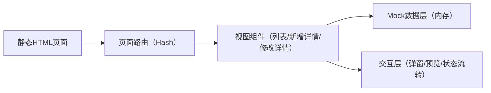

## 1. 架构设计
本交付物为可点击原型预览页，采用纯前端静态资源（HTML/CSS/JS），不依赖后端与数据库，仅使用内置Mock数据模拟状态流转。

## 2. 技术说明
- 前端：单文件 HTML + CSS + 原生 JavaScript（ES2020）
- 构建方式：无构建；直接双击打开或使用本地静态服务器预览
- 数据：内置 JSON（模拟优礼汇来源商品、审核单状态、回传状态）

## 3. 路由定义
| 路由 | 用途 |
|---|---|
| #/audit | 平台商品审核列表 |
| #/audit/new/:id | 新增商品审核详情 |
| #/audit/edit/:id | 修改商品审核详情 |

## 4. 数据模型（原型用）
- 审核单 AuditTicket
  - id: string
  - platformId: "YOU_LI_HUI" | "ERP" | "OMS"
  - type: "NEW" | "EDIT"
  - status: "PENDING" | "REJECTED" | "APPROVED_WAIT_CALLBACK" | "DONE" | "CALLBACK_FAILED"
  - sourceGoodsCode: string
  - goodsName: string
  - barcode: string
  - platformCode?: string
  - rejectReason?: string
  - createdAt: string
- 修改差异 DiffItem（仅type=EDIT时）
  - key: string
  - name: string
  - oldValue: string
  - newValue: string
  - apply: boolean

## 5. 交互策略
- 审核通过：状态立即切换为“通过待回传”，模拟异步回传结果（成功/失败）；失败可点击“重试回传”
- 审核驳回：弹窗必填原因；提交后回到列表并更新状态为“已驳回”
- 修改审核勾选：取消勾选即置灰新值并在“通过”时不应用该字段
- 图片预览：点击缩略图打开预览弹层（画廊切换）
